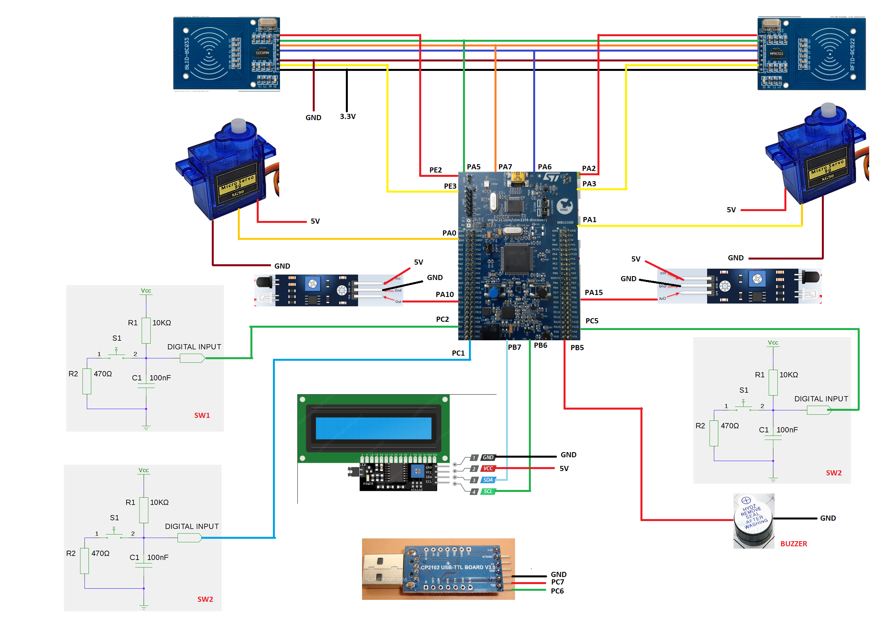
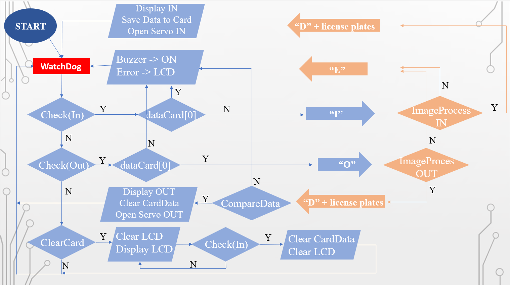

# INTRODUCE
Parking system in/out by magnetic card and image processing.
(In this system, my task is to build the system, and for image rocessing, others do it).
***
# HARDWARE 
#### List of main devices
- **STM32**: responsible for controlling and processing all signals and data of the system.
- **RFID RC522**: to read and write RFID tag data.
- **Servo SG90S**: to control the barier.
- **LCD 16x2**: display the license plate of the vehicle in/out.
- **USB UART**: receive license plate characters after processing images from the computer.
- **Infrared Obstacle Sensor**: to lower the barrier when the vehicle passes.
- **3 Push buttons**: 2 of them to control the barrier, the other to clear the card.
#### Connection
- Wiring diagram:

***
# SOFTWARE

**Input**: 
- When the user swipes the magnetic card, through the UART interface with the STM, the RC522 circuit will send a request signal to send vehicle information to the STM.
- At that time, the processor will ask the camera to send the license plate information and save it on the magnetic card. If valid, the microprocessor will send a signal to control the open barrier bar.
- Khi xe đi qua cảm biến, thanh barier tự động được đóng lại.

**Output**: 
- When the second RC522 circuit receives the magnetic card, the RC522 circuit will ask the microprocessor to compare the data in the tag with the data read from the camera from the outgoing vehicle.
- If the comparison is correct, the magnetic card will be erased all data, the barrier will be opened and when the car goes too sensitive, the barrier bar will also automatically close.
- All information about the vehicle in and out is displayed on the software written in C#

**Besides**: Because the circuit runs completely in a loop, to avoid unexpected program crashes, the system uses the watchdog timer function to avoid.

**Besides**: [link code][1]
***
# RESULT
#### Video demo: [Video][2]

***
# REPORT
[link report][3]

[1]: <>
[2]: <>
[3]: <>

